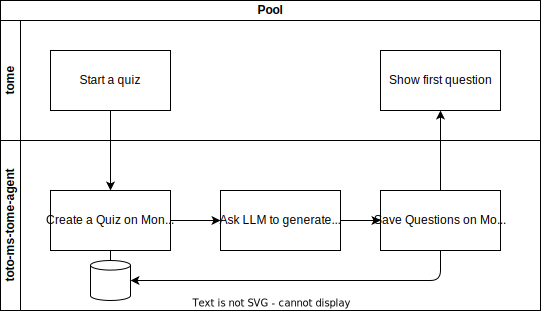

# Tome Processes and Architecture

## 1. Architecture
The architecture of Tome has only two components: 
* The `tome` webapp 
* The `toto-ms-tome-agent` microservice. This service is responsible for handling all of the quizes, including the scoring. It basically implements a BFF pattern.

## 2. Processes
The overall process works as described in the page [Q&A process](./qanda.md). 

### Running a Quiz
A generic quiz is run following these steps: 
1. The Quiz is started on a given topic. 
2. Questions are generated and saved for that Quiz. 
3. The user is presented questions one by one. 
4. Each answer is rated. 
5. The scores are averaged and constitute the Quiz's scores. 

#### Starting a Quiz
The following flow shows how a quiz is started. 

#### Answering a Question
When a user answers a question, the LLM is asked to **rate** the answer and **provide explanations** for the rating.  
Both the rating and explanations are saved and then returned to the `tome` app.  
The user is shown the rating and explanation and can move on to the next question.

