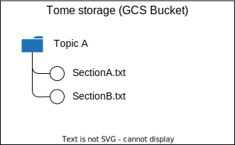

# Tome's Knowledge Base

Tome's Knowledge Base is structured in a very simple manner: 
* There are **Topics** 
* Each Topic is made of **Sections**

Considering the limitations in Context Size of many LLMs, Topics are split into Sections and Q&A tend to be on a Section level.  
Some Q&A could be operating on a summary of a Topic (e.g. a Q&A on the main points of a whole Topic, which would work well on a summary.). 

## GCS Folder Structure
The Knowledge Base is stored on GCS.  
Topics and Sections are stored according to the following convention: 

