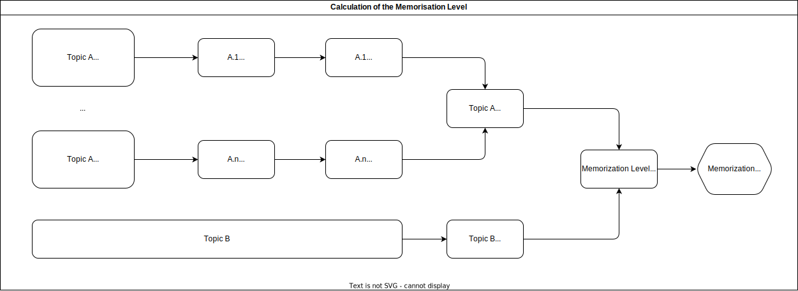

# Memorization Level

In Tome the Memorization Level determines how "fresh" the User memory is, how well is the User remembering the Topics he or she has read about. 

## The Idea behind the calculation

Considering that every topic can be reviewed over multiple TR sessions (e.g. if the Topic has too many sections), one needs to consider that there could be a relevant gap of time between some sections' reviews. 

The idea is that:
* Each Topic Review has an **average score**. 
* That average score **loses relevance over time**. That means that for example: 
    * *a score of `4.5/5` 6 months ago should be worth close to `0` now*
    * *a score of `4.5/5` 1 months ago should be worth close to `3.0` now*
    * *etc..*
* So, each Topic Review's rating, should be "discounted" and I should **calculate the rating "as of today"**, i.e. the updated rating considered the time that has passed. 
* After that, I barely need to **average the scores** and make them a **percentage**. 
* **IN REALITY**, it is **more accurate and fair** to **calculate the rating per Section** and not per Topic.  
The logic being that if I split a Topic in multiple TRs, I will have issues in calculating the rating per Topic.  
If instead I calculated the rating per Section, the Topic Rating is just the average of the Section's ratings. If a section has not been reviewed, then it has rating $0$. 

The result should be like this: 

 

> The Problem is knowing how fast do ratings lose relevance.  
> i.e. how fast to I forget.  
> This is a **good problem for an ML model to learn over time**. 

**Without an ML model**, I adopt the following rationales: 
* A score will `go to zero` if the review happened **more than 6 months ago**. 
* A score will **lose $15\%$ every two weeks**. 

## Ideas for ML

 * A topic that I've reviewed a great number of times in the past might be harder to forget.  
 That means that the Forgetting Rate could be **dependent from how much I have reviewed the Topic in the past**.

 * The **User's age** could also be relevant on the Forgetting Rate. 

 * **How wide the Topic is** could also be relevant on the Forgetting Rate.  
 Very big Topics, with a lot of detail are harder to retain.  
 Some metrics could be:
    * Number of Sections in a Topic
    * **Number of words** in a Topic