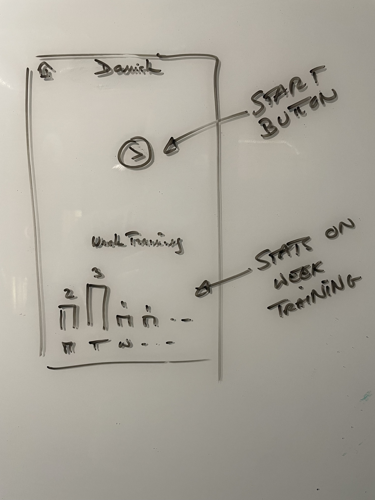

# Leaning Language Home Page

In the Tome app, the Language Learning screen is accessed through the side menu. 

Adjust the `width` value (400px, 50%, etc.) to your preference. Standard markdown image syntax doesn't support sizing directly, so one of these approaches is recommended.

The Home Page presents the following sections: 
1. **Header** - (normal app header, with a title and back button).
2. **Practice Buttons** - A "start practice" button or, if a practice is already ongoing, a "resume practice" button.
3. **Learning Stats** - A bottom part (always placed at the bottom of the home page) that displays weekly learning stats as a bar graph. *See below for more specs*. 

### Learning Stats
The Learning Stats is a **bar graph**, as shown in the above Layout Drawing.   
For now it only represents, for each day of the current week, the number of practices that have been performed for that day. 

*Note that the week starts on the Monday and ends on the Sunday*.

*Implementation note*: the graph 
- must be implemented using d3.js
- must have the same look and feel of the monthly spending graph displayed in the home page of the https://github.com/nicolasances/toto-reactjs-expenses app.
- must have animations that "grow vertically" the bars when the graph loads. 

