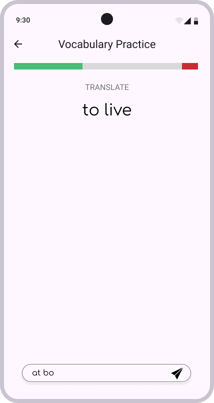
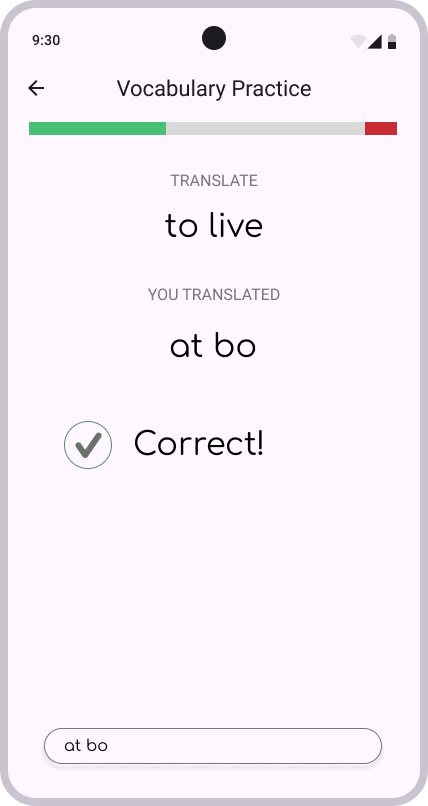

# Vocabulary Practice — Feature Spec

## Overview

Vocabulary Practice is a language-learning feature that trains the user to recall the target-language (TL) translation of words they are studying. The user is shown a word in the source language (English) and must type the correct TL word from memory. The goal is active recall and correct production — not recognition.

The target language currently supported is **Danish**.

All session content — vocabulary items and expected answers — is **generated and supplied by the backend API**. The app is responsible only for presenting challenges and processing responses.

## Mock interface

---

## Entry Point

The user accesses Vocabulary Practice from the Language Learning section of the app. No setup or configuration is required before starting a session.

A **loading spinner** is displayed while the session data is being fetched from the backend API. Once the data is ready, the first word is shown immediately.

---

## Session Persistence & Resuming

Sessions are **persisted on the backend**. If the user exits a session before completing it (e.g. by tapping the back button), the session remains open on the server and can be resumed later.

The Language Learning home page detects whether an active session exists for the current user and presents a **Resume Practice** button in place of the Start button. See the [Language Learning Home Page spec](./home-page.md) for details.

When resuming, the backend restores the **exact queue state** — including which word was current, which words are still pending, and which are deferred. The app loads this state and resumes from where the user left off. A loading spinner is displayed while the session state is being fetched.

A user with an active session **cannot start a new session** until the active one is completed.

---

## Session Structure

* The **number of words** in a session is determined and returned by the backend API; the app does not hard-code this value.
* Words are drawn from the user's active vocabulary list.
* Words are presented one at a time.

---

## User Flow

### 0. Loading

On session start or resume, a loading spinner is displayed while the app fetches session data from the backend. Once ready, the first word prompt is shown.

### 1. Word Prompt

* The app displays a **"TRANSLATE"** label and the **source-language word** (English) prominently in the centre of the screen.
* A **text input field** is pinned at the bottom of the screen for the user to type their answer.
* A **submit button** inside the input field (or pressing Enter) confirms the answer.
* When a new word is shown, the input field is **cleared and auto-focused** so the user can start typing immediately.

### 2. Answer Evaluation

The app evaluates the answer immediately after submission using a **case-insensitive exact string match** against the expected TL word.

* Punctuation and whitespace handling follows the same case-insensitive rule (trim leading/trailing spaces before matching).

The word-prompt area transitions to a **result view** (described below) while the input field remains visible at the bottom of the screen (disabled during the feedback pause).

#### 2a. Correct Answer

The result view shows:
1. The original source-language word (unchanged).
2. A **"YOU TRANSLATED"** label followed by the user's answer.
3. A **green checkmark** and the text **"Correct!"**.

After **3 seconds**, the app automatically clears the result view, clears the input field, and advances to the next word in the queue.

#### 2b. Wrong Answer

The result view shows:
1. The original source-language word (unchanged).
2. A **"YOU TRANSLATED"** label followed by the user's (wrong) answer.
3. A **red cross** and the text **"Wrong!"**.
4. The **correct TL word** displayed below the wrong indicator.

After **3 seconds**, the word is **moved to the end of the session queue** (it will be shown again later in the session). The app clears the result view, clears the input field, and advances to the next word in the queue.

### 3. Session Completion

* A word is considered **mastered for this session** once the user answers it correctly.
* The session ends when **all words have been answered correctly** (including words that were previously answered incorrectly and deferred).
* On session completion, the app navigates to the **[Session Summary Screen](./language-learning-summary.md)**.

---

## Progress Bar

A **tri-segment progress bar** is displayed at the top of the screen throughout the session. It gives the user an at-a-glance view of their progress:

| Segment | Colour | Meaning |
|---------|--------|---------|
| Left | **Green** | Words answered correctly (mastered) |
| Middle | **Grey** | Words not yet practiced in this session |
| Right | **Red** | Words answered incorrectly (deferred — waiting to be retried) |

Each segment's width is proportional to the number of words it represents, relative to the total session size.

When a deferred (red) word is eventually answered correctly, its portion moves from the red segment to the green segment.

---

## Exit Behaviour (Back Button)

Tapping the **back button** in the header during an active session exits the session immediately — no confirmation dialog is shown.

The session state (current word, pending queue, deferred words) is **saved on the backend**. The user can return to it at any time via the **Resume Practice** button on the Language Learning home page. The progress bar state is also preserved.

---

## Answer Validation Rules

| Rule | Detail |
|------|--------|
| Matching method | Exact string match |
| Case sensitivity | Case-insensitive |
| Whitespace | Leading and trailing spaces are trimmed before matching |
| Special characters | No tolerance for missing special characters (æ, ø, å must match exactly) |
| Validation location | Client-side (no API call required) |

---

## State Management

| State | Description |
|-------|-------------|
| **Pending queue** | Words not yet answered correctly in this session |
| **Mastered** | Words answered correctly; removed from the queue |
| **Deferred** | Words answered incorrectly; appended to the end of the pending queue |

At any point during the session, the app must track:
* The ordered pending queue
* The number of items originally in the session
* The number of items answered correctly on the first attempt (used on the summary screen)

---

## Edge Cases

* If the user submits an empty answer, the app treats it as a wrong answer and follows the wrong-answer flow.
* The session cannot be completed until every word has been answered correctly at least once; there is no skip option.

---

## Out of Scope

* Hints or partial-credit scoring are not supported.
* Audio pronunciation is not part of this feature.
* Comparing results across sessions is not supported.
